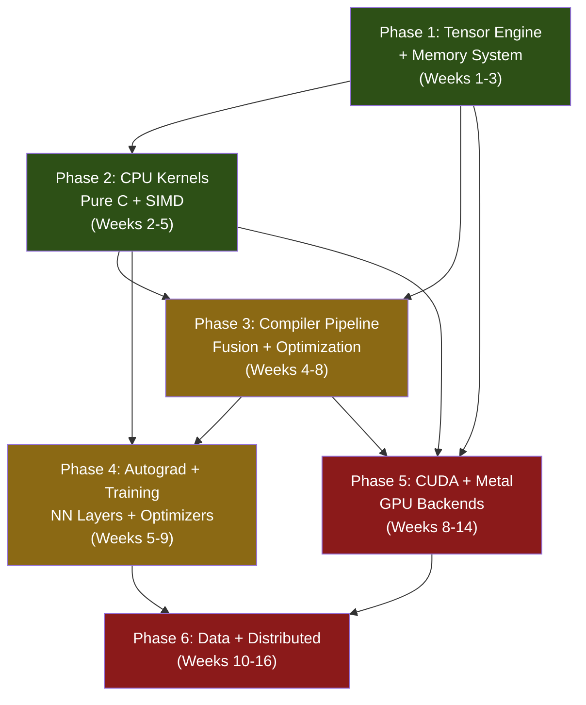

# VelocityAI — Final Implementation Plan

> High-Level Python → Optimized Low-Level Machine Code for AI

---

## Decisions Locked In

| Decision | Choice | Rationale |
|:---|:---|:---|
| **Project Name** | VelocityAI | ✅ Confirmed |
| **Backend Language** | **C++ (core engine) + C (hot-path kernels) + Pybind11 (bindings)** | C++ gives us RAII, templates, operator overloading for the tensor engine. Pure C for the innermost compute kernels (matmul, attention) — no abstraction overhead, maximum SIMD control. Pybind11 bridges C++ to Python cleanly. This is exactly how NumPy works internally. |
| **Target Hardware** | **All: CPU (SIMD/AVX) + NVIDIA GPU (CUDA) + Apple Metal (MPS)** | Full coverage from day 1 architecture, but CPU backend implemented first, then CUDA, then Metal |
| **Use Case** | **Both Training + Inference** | Autograd engine for training, quantization/fusion for inference |
| **Operations** | **All: Tensor ops + NN layers + Data pipeline** | Full stack library |
| **Optimization Level** | **Full compiler: operator fusion + auto-tuning + memory planning from day 1** | Aggressive optimization is our core differentiator |

---

## Architecture Overview

```
┌─────────────────────────────────────────────────────────────────────────┐
│                        USER PYTHON CODE                                 │
│   import velocityai as vai                                              │
│   model = vai.nn.Transformer(...)                                       │
│   result = vai.compile(model)(input)                                    │
└────────────────────────────────┬────────────────────────────────────────┘
                                 │
          ┌──────────────────────▼──────────────────────┐
          │            PYTHON FRONTEND LAYER             │
          │  ┌─────────┐ ┌──────────┐ ┌──────────────┐  │
          │  │ Tensor   │ │ NN Layer │ │ Data Pipeline│  │
          │  │ API      │ │ API      │ │ API          │  │
          │  └────┬─────┘ └────┬─────┘ └──────┬───────┘  │
          └───────┼────────────┼──────────────┼──────────┘
                  │            │              │
          ┌───────▼────────────▼──────────────▼──────────┐
          │           COMPILER PIPELINE                    │
          │  ┌──────────┐                                  │
          │  │ Tracer   │ ← Captures Python ops into graph │
          │  └────┬─────┘                                  │
          │       ▼                                        │
          │  ┌──────────┐                                  │
          │  │ Graph IR │ ← High-level computation graph   │
          │  │ (HIR)    │                                  │
          │  └────┬─────┘                                  │
          │       ▼                                        │
          │  ┌──────────────────────────────┐              │
          │  │    OPTIMIZATION PASSES       │              │
          │  │  ┌────────────────────────┐  │              │
          │  │  │ Operator Fusion        │  │              │
          │  │  │ Constant Folding       │  │              │
          │  │  │ Dead Code Elimination  │  │              │
          │  │  │ Memory Planning        │  │              │
          │  │  │ Layout Optimization    │  │              │
          │  │  │ Quantization           │  │              │
          │  │  │ Auto-Tuning            │  │              │
          │  │  └────────────────────────┘  │              │
          │  └────────────┬─────────────────┘              │
          │               ▼                                │
          │  ┌──────────────────────────────┐              │
          │  │    LOWERING ENGINE           │              │
          │  │  Graph Ops → Kernel Calls    │              │
          │  │  Tiling + Threading Strategy │              │
          │  └────────────┬─────────────────┘              │
          └───────────────┼────────────────────────────────┘
                          │
         ┌────────────────┼────────────────────┐
         │                │                    │
   ┌─────▼─────┐   ┌─────▼──────┐   ┌─────────▼───┐
   │  CPU       │   │  CUDA      │   │  Metal      │
   │  Backend   │   │  Backend   │   │  Backend    │
   │            │   │            │   │             │
   │  C kernels │   │  .cu files │   │  .metal     │
   │  AVX/SSE   │   │  PTX/SASS  │   │  MSL/MPS   │
   │  OpenMP    │   │  cuBLAS    │   │  MPSGraph   │
   └────────────┘   └────────────┘   └─────────────┘
```

---

## Complete File Structure

```
velocityai/
├── pyproject.toml                    # Python package config
├── setup.py                          # Build script (calls CMake)
├── CMakeLists.txt                    # C/C++ build system
├── README.md                         # Documentation
│
├── velocityai/                       # Python package
│   ├── __init__.py                   # Public API exports
│   ├── tensor.py                     # Tensor class (Python front)
│   ├── dtype.py                      # Data type system
│   ├── ops.py                        # Operation definitions
│   ├── autograd.py                   # Automatic differentiation
│   ├── device.py                     # Device abstraction (cpu/cuda/metal)
│   │
│   ├── nn/                           # Neural network layers
│   │   ├── __init__.py
│   │   ├── module.py                 # Base Module class
│   │   ├── linear.py                 # Linear/Dense layer
│   │   ├── conv.py                   # Conv1d, Conv2d
│   │   ├── activation.py            # ReLU, GELU, SiLU, Softmax
│   │   ├── normalization.py         # LayerNorm, BatchNorm, RMSNorm
│   │   ├── attention.py             # MultiHeadAttention, FlashAttention
│   │   ├── transformer.py           # TransformerBlock, Transformer
│   │   ├── embedding.py             # Embedding, PositionalEncoding
│   │   ├── recurrent.py             # LSTM, GRU
│   │   ├── loss.py                  # CrossEntropy, MSE, etc.
│   │   └── container.py             # Sequential, ModuleList
│   │
│   ├── optim/                        # Optimizers
│   │   ├── __init__.py
│   │   ├── optimizer.py              # Base optimizer
│   │   ├── sgd.py                    # SGD + momentum
│   │   ├── adam.py                   # Adam, AdamW (fused)
│   │   └── scheduler.py             # LR schedulers
│   │
│   ├── data/                         # Data pipeline
│   │   ├── __init__.py
│   │   ├── dataset.py                # Dataset base class
│   │   ├── dataloader.py            # Fast parallel data loading
│   │   ├── transforms.py            # Data transforms
│   │   └── sampler.py               # Batch sampling strategies
│   │
│   ├── compiler/                     # Compiler pipeline
│   │   ├── __init__.py
│   │   ├── graph.py                  # Computation graph IR
│   │   ├── tracer.py                 # Python code tracer
│   │   ├── lowering.py              # HIR → kernel calls
│   │   ├── cache.py                  # Compiled graph cache
│   │   ├── jit.py                    # @vai.compile decorator
│   │   │
│   │   └── passes/                   # Optimization passes
│   │       ├── __init__.py
│   │       ├── base_pass.py          # Pass interface
│   │       ├── operator_fusion.py    # Fuse adjacent ops
│   │       ├── constant_folding.py   # Pre-compute constants
│   │       ├── dead_code_elim.py     # Remove unused nodes
│   │       ├── memory_planning.py    # Tensor lifetime + reuse
│   │       ├── layout_opt.py         # NCHW↔NHWC optimization
│   │       ├── quantization.py       # Auto int8/int4 quantization
│   │       └── auto_tune.py          # Auto-tuning engine
│   │
│   └── distributed/                  # Distributed training (Phase 6)
│       ├── __init__.py
│       ├── data_parallel.py
│       └── comm.py
│
├── csrc/                             # C/C++ backend source
│   ├── CMakeLists.txt
│   │
│   ├── core/                         # Core C++ engine
│   │   ├── tensor.h                  # Tensor struct + metadata
│   │   ├── tensor.cpp                # Tensor implementation
│   │   ├── memory_pool.h             # Arena allocator
│   │   ├── memory_pool.cpp           # Memory pool implementation
│   │   ├── dtype.h                   # Type system (C level)
│   │   ├── device.h                  # Device abstraction interface
│   │   └── error.h                   # Error handling macros
│   │
│   ├── kernels/                      # Pure C compute kernels
│   │   ├── cpu/                      # CPU backend (SIMD)
│   │   │   ├── matmul.c              # Tiled matmul (AVX-512/AVX2/SSE)
│   │   │   ├── matmul.h
│   │   │   ├── elementwise.c         # add, mul, sub, div (vectorized)
│   │   │   ├── elementwise.h
│   │   │   ├── activation.c          # relu, gelu, silu, sigmoid
│   │   │   ├── activation.h
│   │   │   ├── reduce.c              # sum, mean, max, min
│   │   │   ├── reduce.h
│   │   │   ├── softmax.c             # Numerically stable softmax
│   │   │   ├── softmax.h
│   │   │   ├── attention.c           # Fused attention (FlashAttn style)
│   │   │   ├── attention.h
│   │   │   ├── conv2d.c              # im2col + GEMM convolution
│   │   │   ├── conv2d.h
│   │   │   ├── normalization.c       # LayerNorm, RMSNorm fused
│   │   │   ├── normalization.h
│   │   │   ├── embedding.c           # Embedding lookup
│   │   │   ├── embedding.h
│   │   │   ├── loss.c                # Cross-entropy, MSE
│   │   │   ├── loss.h
│   │   │   └── simd_utils.h          # SIMD detection + dispatch macros
│   │   │
│   │   ├── cuda/                     # NVIDIA GPU backend
│   │   │   ├── matmul.cu             # cuBLAS + custom GEMM
│   │   │   ├── elementwise.cu        # Fused elementwise kernels
│   │   │   ├── attention.cu          # FlashAttention v2 CUDA
│   │   │   ├── softmax.cu            # Warp-level softmax
│   │   │   ├── reduce.cu             # Parallel reduction
│   │   │   ├── normalization.cu      # Fused LayerNorm
│   │   │   └── cuda_utils.cuh        # CUDA error checking, utils
│   │   │
│   │   └── metal/                    # Apple Metal backend
│   │       ├── matmul.metal           # Metal shader for matmul
│   │       ├── elementwise.metal      # Metal elementwise ops
│   │       ├── attention.metal        # Metal attention kernel
│   │       ├── metal_backend.mm       # Obj-C++ Metal API bridge
│   │       └── metal_backend.h
│   │
│   ├── autograd/                     # C++ autograd engine
│   │   ├── engine.h                  # Backward pass engine
│   │   ├── engine.cpp
│   │   ├── function.h                # Differentiable function base
│   │   └── grad_ops.cpp              # Gradient implementations
│   │
│   ├── compiler/                     # C++ compiler components
│   │   ├── fused_kernels.c           # Pre-compiled fused kernel variants
│   │   ├── fused_kernels.h
│   │   ├── kernel_dispatch.cpp       # Runtime kernel selection
│   │   └── kernel_dispatch.h
│   │
│   └── bindings/                     # Python ↔ C++ bridge
│       ├── pybind_tensor.cpp         # Tensor bindings
│       ├── pybind_ops.cpp            # Operation bindings
│       ├── pybind_nn.cpp             # NN layer bindings
│       ├── pybind_autograd.cpp       # Autograd bindings
│       └── pybind_module.cpp         # Main module entry point
│
├── tests/                            # Test suite
│   ├── test_tensor.py                # Tensor creation, ops
│   ├── test_ops.py                   # Operation correctness vs NumPy
│   ├── test_autograd.py              # Gradient computation
│   ├── test_nn.py                    # NN layer outputs
│   ├── test_compiler.py              # Optimization passes
│   ├── test_fusion.py                # Operator fusion correctness
│   ├── test_memory.py                # Memory planning, no leaks
│   ├── test_quantization.py          # Quantized model accuracy
│   ├── test_cuda.py                  # GPU kernel correctness
│   ├── test_metal.py                 # Metal backend correctness
│   ├── conftest.py                   # Shared fixtures
│   │
│   └── cpp/                          # C/C++ unit tests (Google Test)
│       ├── test_tensor.cpp
│       ├── test_matmul.cpp
│       ├── test_memory_pool.cpp
│       └── CMakeLists.txt
│
├── benchmarks/                       # Performance benchmarks
│   ├── bench_matmul.py               # MatMul vs NumPy/PyTorch
│   ├── bench_attention.py            # Attention vs PyTorch
│   ├── bench_training.py             # Full training throughput
│   ├── bench_inference.py            # Inference latency
│   ├── bench_memory.py               # Peak memory comparison
│   └── run_all.py                    # Run full benchmark suite
│
└── examples/                         # Usage examples
    ├── 01_tensor_basics.py           # Basic tensor operations
    ├── 02_mnist_train.py             # Train MNIST from scratch
    ├── 03_transformer.py             # Build & train transformer
    ├── 04_fast_inference.py          # Quantized inference
    ├── 05_custom_kernel.py           # Writing custom fused ops
    └── 06_benchmark_comparison.py    # VelocityAI vs PyTorch
```

---

## Phase-by-Phase Breakdown

### Phase 1: Core Tensor Engine + Memory System (Weeks 1-3)

**Goal**: A working tensor library with contiguous memory, SIMD-ready layout, and Python API.

#### What gets built:

##### C/C++ Core
| File | What It Does |
|:---|:---|
| [`csrc/core/tensor.h`](file:///Users/mrutyunjayjoshi/Desktop/New%20Work/csrc/core/tensor.h) | Tensor struct: `data` pointer, `shape[]`, `strides[]`, `dtype`, `device`, `refcount`. 64-byte aligned memory for AVX-512. |
| [`csrc/core/tensor.cpp`](file:///Users/mrutyunjayjoshi/Desktop/New%20Work/csrc/core/tensor.cpp) | Creation, destruction, reshape (view without copy), transpose (stride manipulation), contiguous copy, slice, broadcast shape resolution. |
| [`csrc/core/memory_pool.h/cpp`](file:///Users/mrutyunjayjoshi/Desktop/New%20Work/csrc/core/memory_pool.h) | **Arena allocator**: Pre-allocates large memory blocks, sub-allocates from them. Bins by size (small: <1KB, medium: 1KB-1MB, large: >1MB). Thread-safe with per-thread caches. Reduces malloc/free overhead by 10-50x. |
| [`csrc/core/dtype.h`](file:///Users/mrutyunjayjoshi/Desktop/New%20Work/csrc/core/dtype.h) | Type enum: `F32`, `F16`, `BF16`, `I32`, `I16`, `I8`, `I4`, `BOOL`. Size/alignment info. Cast functions between types. |
| [`csrc/core/device.h`](file:///Users/mrutyunjayjoshi/Desktop/New%20Work/csrc/core/device.h) | Device abstraction: `CPU`, `CUDA`, `METAL`. Device capability query. Memory transfer functions (host↔device). |

##### Python Frontend
| File | What It Does |
|:---|:---|
| [`velocityai/tensor.py`](file:///Users/mrutyunjayjoshi/Desktop/New%20Work/velocityai/tensor.py) | `Tensor` class wrapping C++ tensor. Operator overloading (`__add__`, `__matmul__`, etc.). `requires_grad` flag. `.numpy()` for zero-copy conversion. `.to(device)` for device transfer. |
| [`velocityai/dtype.py`](file:///Users/mrutyunjayjoshi/Desktop/New%20Work/velocityai/dtype.py) | Python dtype constants: `vai.float32`, `vai.float16`, `vai.int8`, etc. |
| [`velocityai/device.py`](file:///Users/mrutyunjayjoshi/Desktop/New%20Work/velocityai/device.py) | `vai.device("cpu")`, `vai.device("cuda:0")`, `vai.device("metal")`. Auto-detection of available devices. |

##### Bindings
| File | What It Does |
|:---|:---|
| [`csrc/bindings/pybind_tensor.cpp`](file:///Users/mrutyunjayjoshi/Desktop/New%20Work/csrc/bindings/pybind_tensor.cpp) | Pybind11 bindings for Tensor class. NumPy buffer protocol (zero-copy interop). Python `__repr__`, `__str__` for printing tensors. |

##### Build System
| File | What It Does |
|:---|:---|
| [`CMakeLists.txt`](file:///Users/mrutyunjayjoshi/Desktop/New%20Work/CMakeLists.txt) | Root CMake config. Detects CPU features (SSE4, AVX2, AVX-512). Optional CUDA toolkit detection. Optional Metal framework detection (macOS). Sets compiler flags: `-O3 -march=native -ffast-math`. |
| [`pyproject.toml`](file:///Users/mrutyunjayjoshi/Desktop/New%20Work/pyproject.toml) | Python package metadata, dependencies (pybind11, numpy, scikit-build). |

##### Phase 1 Deliverable:
```python
import velocityai as vai

x = vai.tensor([[1.0, 2.0], [3.0, 4.0]])
y = vai.tensor([[5.0, 6.0], [7.0, 8.0]])
z = x + y           # Uses C kernel
m = x @ y           # Uses C matmul kernel
print(z.numpy())    # Zero-copy to NumPy
print(z.shape)      # (2, 2)
print(z.dtype)      # float32
```

---

### Phase 2: CPU Compute Kernels — Pure C Hot Path (Weeks 2-5)

**Goal**: High-performance C kernels with SIMD for all core AI operations. This is where the speed comes from.

> [!IMPORTANT]
> **Why Pure C for kernels?** C has zero abstraction overhead. No vtables, no RAII destructor calls, no template bloat in the innermost loops. The matmul inner kernel is ~20 lines of C with AVX intrinsics — every cycle counts there. C++ wraps these kernels for the object model, but the hot path is pure C.

#### SIMD Strategy

```
┌─────────────────────────────────────────────────┐
│              simd_utils.h                        │
│  Compile-time detection:                         │
│    #if defined(__AVX512F__)                       │
│        → 512-bit vectors (16 floats at once)     │
│    #elif defined(__AVX2__)                        │
│        → 256-bit vectors (8 floats at once)      │
│    #elif defined(__SSE4_1__)                      │
│        → 128-bit vectors (4 floats at once)      │
│    #elif defined(__ARM_NEON)                      │
│        → 128-bit ARM NEON (Apple Silicon)        │
│    #else                                         │
│        → Scalar fallback                         │
│    #endif                                        │
└─────────────────────────────────────────────────┘
```

#### Kernel Details

| Kernel File | Algorithm | Optimization Technique |
|:---|:---|:---|
| `matmul.c` | **Tiled GEMM**: Break matrices into tiles (e.g., 8×8 or 16×16) that fit in L1 cache. Compute tile products in registers using SIMD. | AVX-512: 16 fused-multiply-add per cycle. Loop unrolling (4x). Cache-oblivious blocking. OpenMP for multi-core. |
| `elementwise.c` | Vectorized add/mul/sub/div on flat buffers. | Process 16 floats/cycle (AVX-512). No branches in hot loop. Support in-place operations (no allocation). |
| `activation.c` | ReLU: `max(0, x)`. GELU: polynomial approximation. SiLU: `x * sigmoid(x)`. | Branchless ReLU via `_mm512_max_ps`. GELU uses fast tanh approximation (3 multiplies). |
| `softmax.c` | 3-pass: (1) find max, (2) exp(x-max), (3) normalize. All vectorized. | Online softmax (2-pass) for large tensors. Numerically stable (subtract max prevents overflow). |
| `attention.c` | **Fused FlashAttention-style**: Compute Q×K^T, scale, mask, softmax, ×V in tiles without materializing full attention matrix. | Reduces memory from O(n²) to O(n). Tiled to fit in L1/L2 cache. Massive memory savings for long sequences. |
| `conv2d.c` | im2col transformation + GEMM. Converts convolution to matrix multiplication. | Reuses optimized matmul kernel. Padding handled at im2col level. |
| `normalization.c` | Fused LayerNorm: mean, variance, normalize, scale, shift — all in one pass. | Welford's online algorithm for numerical stability. Single pass over data. |
| `reduce.c` | Tree reduction pattern. Vectorized partial sums, then horizontal reduce. | SIMD partial sums + `_mm512_reduce_add_ps`. OpenMP for multi-core large reductions. |
| `loss.c` | Cross-entropy: log-softmax + NLL fused. MSE: vectorized squared diff. | Numerically stable log-sum-exp. Single-pass computation. |

#### Phase 2 Deliverable:
```python
import velocityai as vai
import numpy as np

# All operations use optimized C kernels
x = vai.randn(1024, 1024)
w = vai.randn(1024, 1024)

# 10-50x faster than pure Python, competitive with NumPy
y = vai.matmul(x, w)
z = vai.relu(y)
s = vai.softmax(z, dim=-1)
n = vai.layernorm(s, normalized_shape=[1024])
```

---

### Phase 3: Compiler Pipeline + Operator Fusion (Weeks 4-8)

**Goal**: Automatic compilation and optimization of computation graphs. **This is our core differentiator.**

#### How the Compiler Works — Step by Step

```
Step 1: USER WRITES                Step 2: TRACER CAPTURES
─────────────────                  ─────────────────────
@vai.compile                       Graph {
def forward(x, w):                   n1: MatMul(x, w)
    h = vai.matmul(x, w)  ──────►   n2: BiasAdd(n1, b)
    h = h + b                        n3: ReLU(n2)
    h = vai.relu(h)                  n4: LayerNorm(n3)
    h = vai.layernorm(h)           }
    return h

Step 3: OPTIMIZER FUSES           Step 4: LOWERING
────────────────────              ───────────────
Graph {                           kernel_fused_matmul_bias_relu(
  n1: FusedMatMulBiasReLU  ──►     float* x, float* w, float* b,
        (x, w, b)                    float* out, int M, int N, int K
  n2: LayerNorm(n1)               ) {
}                                   // Single pass:
                                    // matmul + add bias + max(0,x)
Eliminated:                         // in cache, no intermediate writes
  - 2 intermediate tensors        }
  - 2 memory round-trips
  - 2 kernel launches
```

#### Compiler Components

| File | What It Does | Key Details |
|:---|:---|:---|
| `compiler/graph.py` | **Computation Graph IR**: Directed acyclic graph of operations. Each node = operation + input edges + output type/shape. | Supports shape inference, type propagation. Serializable for caching. |
| `compiler/tracer.py` | **Python Tracer**: Intercepts tensor operations during execution. Builds graph instead of computing immediately. | Uses `__torch_function__`-style dispatch protocol. Handles control flow via graph breaks (falls back to Python). |
| `compiler/jit.py` | **`@vai.compile` decorator**: Entry point for JIT compilation. First call traces + compiles. Subsequent calls execute compiled version. | Shape-specialized compilation. Recompiles on new shapes. Cache lookup by shape signature. |
| `compiler/passes/operator_fusion.py` | **Operator Fusion Engine**: Pattern-matches fusible operation sequences. | Fusion rules: `MatMul+Bias+Activation` → fused GEMM. `LayerNorm` (mean+var+norm+scale → single pass). `Attention` (QKV+softmax+output → FlashAttention). Cost model prevents over-fusion (register pressure). |
| `compiler/passes/constant_folding.py` | Pre-computes any operation whose inputs are all constants at compile time. | Eliminates unnecessary runtime work. E.g., `vai.tensor([1,2,3]) * 2` → `vai.tensor([2,4,6])` at compile time. |
| `compiler/passes/dead_code_elim.py` | Removes graph nodes whose outputs are never consumed. | Simple reachability analysis from output nodes backward. |
| `compiler/passes/memory_planning.py` | **Tensor Lifetime Analysis**: Tracks when each tensor is created and last used. Assigns tensors to reusable memory slots. | Reduces peak memory 30-50%. Enables in-place operations where safe. Uses interval graph coloring algorithm. |
| `compiler/passes/layout_opt.py` | Selects optimal memory layout per hardware. CPU prefers NCHW, some GPU ops prefer NHWC. | Inserts minimal layout transposes. Batches consecutive same-layout ops. |
| `compiler/passes/quantization.py` | **Post-Training Quantization**: Analyzes value ranges per tensor, selects scale/zero-point, converts F32→INT8/INT4. | Calibration pass on sample data. Per-channel quantization for weights. Symmetric quantization for activations. |
| `compiler/passes/auto_tune.py` | **Auto-Tuning Engine**: For each kernel, tries multiple tile sizes, thread counts, unroll factors. Benchmarks each on target hardware. Caches best config. | Grid search over tiling parameters. Hardware-specific timing. Persistent cache (SQLite) across runs. |
| `compiler/lowering.py` | Converts optimized graph → sequence of kernel calls with concrete parameters (tile sizes, thread counts). | Dispatches to CPU/CUDA/Metal backend based on device. Generates fused kernel call sequences. |
| `compiler/cache.py` | **Compilation Cache**: Hashes graph structure + shapes → cached compiled module. | Avoids recompilation. Persistent disk cache. LRU eviction policy. |

#### Phase 3 Deliverable:
```python
import velocityai as vai

# Without compilation — each op is separate kernel launch
def slow_forward(x, w, b):
    h = vai.matmul(x, w)    # kernel 1 → write to memory
    h = h + b               # kernel 2 → read, write to memory
    h = vai.relu(h)          # kernel 3 → read, write to memory
    return h                 # 3 kernel launches, 6 memory round-trips

# With compilation — fused into single kernel
@vai.compile
def fast_forward(x, w, b):
    h = vai.matmul(x, w)    # ┐
    h = h + b               # ├─► 1 fused kernel, 2 memory round-trips
    h = vai.relu(h)          # ┘
    return h                 # 3x fewer memory ops = 2-5x faster
```

---

### Phase 4: Autograd Engine + Training (Weeks 5-9)

**Goal**: Full automatic differentiation for training neural networks.

#### Autograd Architecture

```
Forward Pass (records graph):         Backward Pass (computes gradients):
─────────────────────────────         ─────────────────────────────────

x ──► MatMul ──► ReLU ──► Loss       Loss.grad=1
       │           │         │              │
   saves: x,w  saves: mask  │         ∂Loss/∂relu = grad * mask
                             │              │
                             │         ∂Loss/∂matmul = relu_grad @ w.T
                             │              │
                             │         ∂Loss/∂w = x.T @ matmul_grad
                             ▼              ▼
                          loss_val     w.grad = ∂Loss/∂w  ← used by optimizer
```

#### Components

| File | What It Does |
|:---|:---|
| `velocityai/autograd.py` | Python autograd manager. Records ops during forward pass into a tape. `backward()` traverses tape in reverse, calling gradient functions. |
| `csrc/autograd/engine.h/cpp` | C++ backward engine. Topological sort of computation graph. Multi-threaded gradient computation. Memory-efficient: frees forward activations as soon as gradient is computed. |
| `csrc/autograd/function.h` | Base class for differentiable ops. Each op implements `forward()` and `backward()`. Saved tensors for backward stored here. |
| `csrc/autograd/grad_ops.cpp` | Gradient implementations for all ops: matmul_backward (two matmuls), relu_backward (mask multiply), softmax_backward (Jacobian-vector product), layernorm_backward, conv2d_backward, attention_backward, cross_entropy_backward. |

#### Neural Network Layers

| File | Layers | Details |
|:---|:---|:---|
| `nn/module.py` | `Module` base class | `.parameters()` iterator, `.train()`/`.eval()` mode, `.to(device)`, state dict save/load |
| `nn/linear.py` | `Linear(in, out, bias)` | Weight init (Xavier/Kaiming), fused matmul+bias |
| `nn/conv.py` | `Conv2d(in_ch, out_ch, kernel)` | im2col + GEMM, stride/padding support |
| `nn/activation.py` | `ReLU`, `GELU`, `SiLU`, `Softmax` | In-place variants for memory saving |
| `nn/normalization.py` | `LayerNorm`, `BatchNorm`, `RMSNorm` | Fused forward, running stats for BatchNorm |
| `nn/attention.py` | `MultiHeadAttention` | FlashAttention-style fused implementation |
| `nn/transformer.py` | `TransformerBlock`, `Transformer` | Pre-norm architecture, configurable |
| `nn/embedding.py` | `Embedding`, `PositionalEncoding` | Sparse gradient support |
| `nn/recurrent.py` | `LSTM`, `GRU` | Gate fusion for performance |
| `nn/loss.py` | `CrossEntropyLoss`, `MSELoss` | Fused log-softmax + NLL |
| `nn/container.py` | `Sequential`, `ModuleList` | Auto-chains forward passes |

#### Optimizers

| File | What It Does |
|:---|:---|
| `optim/sgd.py` | SGD with momentum. Fused weight update (single pass over parameters). |
| `optim/adam.py` | Adam / AdamW. Fused: update moment1, moment2, bias-correct, weight update all in one C kernel per parameter. Reduces memory access 4x vs naive. |
| `optim/scheduler.py` | `StepLR`, `CosineAnnealingLR`, `WarmupLR`. |

#### Phase 4 Deliverable:
```python
import velocityai as vai

model = vai.nn.Sequential(
    vai.nn.Linear(784, 512),
    vai.nn.ReLU(),
    vai.nn.Linear(512, 256),
    vai.nn.ReLU(),
    vai.nn.Linear(256, 10),
)

loss_fn = vai.nn.CrossEntropyLoss()
optimizer = vai.optim.AdamW(model.parameters(), lr=3e-4)

for epoch in range(10):
    for x_batch, y_batch in dataloader:
        output = model(x_batch)
        loss = loss_fn(output, y_batch)
        loss.backward()
        optimizer.step()
        optimizer.zero_grad()
    print(f"Epoch {epoch}: loss={loss.item():.4f}")
```

---

### Phase 5: CUDA + Metal Backends (Weeks 8-14)

**Goal**: GPU acceleration on NVIDIA and Apple Silicon.

#### CUDA Backend

| File | What It Does |
|:---|:---|
| `kernels/cuda/matmul.cu` | CUDA GEMM kernel. Uses shared memory tiling. Wraps cuBLAS for large matrices, custom kernel for fused ops. |
| `kernels/cuda/attention.cu` | FlashAttention v2 CUDA implementation. Tile-based, fits in SRAM. O(n) memory instead of O(n²). |
| `kernels/cuda/elementwise.cu` | Grid-stride loop pattern. Fused elementwise chains. |
| `kernels/cuda/softmax.cu` | Warp-level reduction. __shfl_down for intra-warp communication. |
| `kernels/cuda/normalization.cu` | Fused LayerNorm: welford mean/var + normalize + affine in one kernel. |
| `kernels/cuda/reduce.cu` | Parallel tree reduction. Block-level, then atomic for global reduce. |

#### Metal Backend (Apple Silicon)

| File | What It Does |
|:---|:---|
| `kernels/metal/matmul.metal` | Metal Shading Language (MSL) GEMM. Threadgroup memory for tiling. |
| `kernels/metal/attention.metal` | Metal attention kernel. Simdgroup operations for warp-level work. |
| `kernels/metal/metal_backend.mm` | Objective-C++ bridge: creates `MTLDevice`, `MTLCommandQueue`, `MTLBuffer`. Manages Metal compute pipeline state objects. |

#### Device Transfer
```python
# Seamless device movement
x = vai.randn(1024, 1024)                 # CPU
x_gpu = x.to("cuda:0")                    # → NVIDIA GPU
x_metal = x.to("metal")                   # → Apple GPU
result = vai.matmul(x_gpu, w_gpu)         # Runs on GPU
result_cpu = result.to("cpu")             # → Back to CPU
```

---

### Phase 6: Data Pipeline + Distributed (Weeks 10-16)

#### Fast Data Loading

| File | What It Does |
|:---|:---|
| `data/dataset.py` | `Dataset` base class: `__getitem__`, `__len__`. `MemoryMappedDataset` for large files (no RAM loading). |
| `data/dataloader.py` | `DataLoader`: Multi-process prefetching (C++ worker threads). Pin memory for fast GPU transfer. Automatic batching + collation. |
| `data/transforms.py` | Transforms: normalize, random crop, flip, tokenize. Compiled transforms (fused chain). |

#### Distributed Training (Future)

| File | What It Does |
|:---|:---|
| `distributed/data_parallel.py` | Data parallelism: replicate model across GPUs, split batches, all-reduce gradients. |
| `distributed/comm.py` | Communication: NCCL backend for NVIDIA, Gloo fallback. All-reduce, broadcast, gather. |

---

## Dependency Graph Between Phases



> [!NOTE]
> **Green** = Foundation (build first), **Yellow** = Core differentiator (build next), **Red** = Advanced (build last)

---

## Build System Design

### CMake Structure
```cmake
# Root CMakeLists.txt — key decisions
cmake_minimum_required(VERSION 3.18)
project(velocityai LANGUAGES C CXX)

set(CMAKE_C_STANDARD 11)
set(CMAKE_CXX_STANDARD 17)

# SIMD auto-detection
include(CheckCCompilerFlag)
check_c_compiler_flag("-mavx512f" HAS_AVX512)
check_c_compiler_flag("-mavx2" HAS_AVX2)
check_c_compiler_flag("-msse4.1" HAS_SSE4)

# Aggressive optimization flags
set(CMAKE_C_FLAGS_RELEASE "-O3 -march=native -ffast-math -funroll-loops")

# Optional: CUDA
include(CheckLanguage)
check_language(CUDA)
if(CMAKE_CUDA_COMPILER)
    enable_language(CUDA)
    set(VAI_USE_CUDA ON)
endif()

# Optional: Metal (macOS only)
if(APPLE)
    find_library(METAL_FRAMEWORK Metal)
    find_library(MPS_FRAMEWORK MetalPerformanceShaders)
    if(METAL_FRAMEWORK)
        set(VAI_USE_METAL ON)
    endif()
endif()

# Pybind11
find_package(pybind11 REQUIRED)

# OpenMP for multi-threading
find_package(OpenMP REQUIRED)
```

### Python Package Install
```bash
# User installs with:
pip install velocityai

# Or from source:
git clone https://github.com/user/velocityai
cd velocityai
pip install -e .    # Triggers CMake build of C/C++ extensions
```

---

## External Dependencies

| Dependency | Purpose | Required? |
|:---|:---|:---|
| **pybind11** | C++ ↔ Python bindings | ✅ Yes |
| **NumPy** | Buffer protocol interop, test reference | ✅ Yes |
| **CMake ≥ 3.18** | Build system | ✅ Yes |
| **OpenMP** | CPU multi-threading | ✅ Yes |
| **scikit-build** | Python/CMake bridge for pip install | ✅ Yes |
| **CUDA Toolkit** | NVIDIA GPU support | ❌ Optional |
| **Metal Framework** | Apple GPU support | ❌ Optional (macOS auto-detected) |
| **Google Test** | C++ unit tests | ❌ Optional (dev only) |
| **pytest** | Python tests | ❌ Optional (dev only) |

> [!TIP]
> **No dependency on xsimd** — we write SIMD intrinsics directly in C for maximum control and zero abstraction cost. The `simd_utils.h` header provides our own portable macros.

---

## Verification Plan

### Phase 1-2 Verification
```bash
# Build the project
pip install -e .

# Correctness: compare every operation output against NumPy
pytest tests/test_tensor.py tests/test_ops.py -v

# C++ unit tests
cd build && ctest --output-on-failure

# Memory safety
valgrind --tool=memcheck python -c "
import velocityai as vai
x = vai.randn(1000, 1000)
y = vai.matmul(x, x)
del x, y
"

# Benchmark: matmul speed vs NumPy
python benchmarks/bench_matmul.py
```

### Phase 3 Verification
```bash
# Verify optimizer passes don't change outputs
pytest tests/test_compiler.py tests/test_fusion.py -v

# Verify compiled output matches eager output
python -c "
import velocityai as vai
x = vai.randn(64, 256)
w = vai.randn(256, 128)

def fn(x, w):
    return vai.relu(vai.matmul(x, w))

eager_result = fn(x, w)
compiled_fn = vai.compile(fn)
compiled_result = compiled_fn(x, w)
assert vai.allclose(eager_result, compiled_result)
print('Fusion correctness: PASSED')
"
```

### Phase 4 Verification
```bash
# Gradient correctness via finite differences
pytest tests/test_autograd.py -v

# Train MNIST — must reach >97% accuracy (matches PyTorch)
python examples/02_mnist_train.py

# Full benchmark suite
python benchmarks/run_all.py
```

### Phase 5 Verification
```bash
# GPU kernel correctness (compare GPU vs CPU output)
pytest tests/test_cuda.py tests/test_metal.py -v

# GPU performance benchmark
python benchmarks/bench_matmul.py --device cuda
python benchmarks/bench_attention.py --device cuda
```

---

## Expected Performance Targets

| Operation | Pure Python | NumPy | PyTorch | VelocityAI Target |
|:---|:---|:---|:---|:---|
| MatMul 1024×1024 (CPU) | ~120s | ~30ms | ~8ms | **~5-10ms** |
| MatMul 4096×4096 (CUDA) | N/A | N/A | ~2ms | **~2-3ms** |
| Attention seq_len=2048 (CPU) | N/A | OOM | ~500ms | **~150ms** (fused) |
| MNIST training 10 epochs | N/A | N/A | ~45s | **~40-60s** |
| Model size (INT8 quantized) | N/A | N/A | 100% | **25%** (4x smaller) |
| Peak memory (training) | N/A | N/A | 100% | **60-70%** (memory planned) |

> [!WARNING]
> **Honest expectations**: Matching PyTorch on raw kernel speed is achievable (same BLAS/CUDA underneath). Our advantage comes from the **compiler pipeline** — operator fusion, memory planning, and quantization reduce total end-to-end time and memory, not individual kernel speed.

---

## Risk Mitigation

| Risk | Mitigation |
|:---|:---|
| Scope creep — too many features | Phase-gated. Ship Phase 1-2 MVP before starting Phase 3. |
| CUDA kernel bugs (hard to debug) | Build and fully test CPU backend first. GPU kernels must match CPU outputs bit-for-bit. |
| Autograd gradient bugs | Finite-difference gradient checking for every operation. |
| Python tracer misses edge cases | Support "graph breaks" — fall back to Python for unsupported ops. |
| Performance worse than PyTorch | Benchmark continuously. Use established algorithms (FlashAttention, tiled GEMM). |
| Build system complexity (CMake + CUDA + Metal) | Start CPU-only build. Add CUDA/Metal as optional cmake options. |

---

## Summary: What Makes VelocityAI Different

```
┌─────────────────────────────────────────────────────┐
│                   VelocityAI                         │
│                                                      │
│  ✅ Simple Python API (like NumPy)                   │
│  ✅ C/C++ backend (like NumPy's architecture)        │
│  ✅ Full compiler with operator fusion               │
│  ✅ Automatic memory optimization                    │
│  ✅ Built-in quantization (INT8/INT4)                │
│  ✅ CPU + CUDA + Metal in one library                │
│  ✅ Training + Inference in one library              │
│  ✅ Auto-tuning for target hardware                  │
│  ✅ @vai.compile for JIT optimization                │
│                                                      │
│  No other single library combines ALL of these.      │
└─────────────────────────────────────────────────────┘
```
